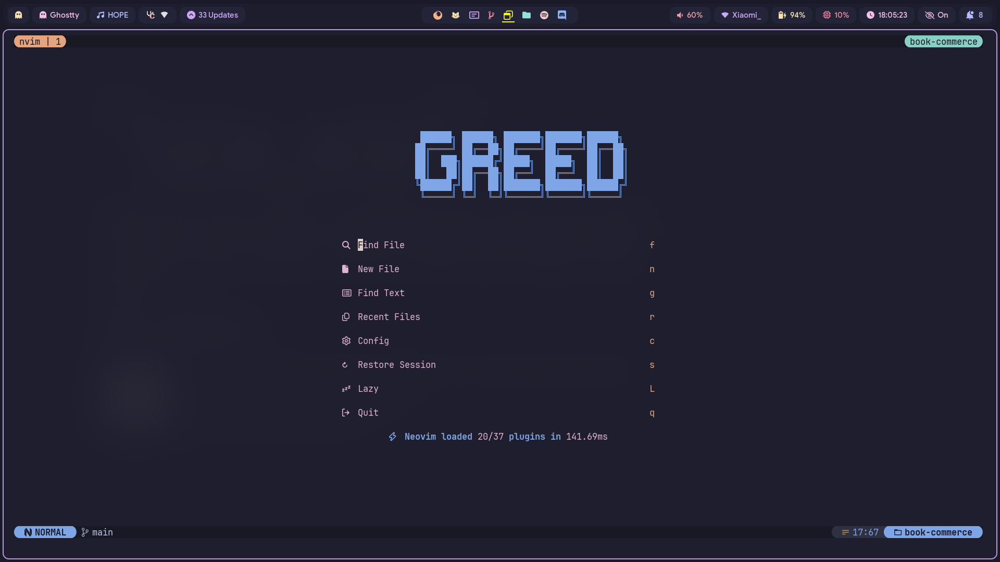
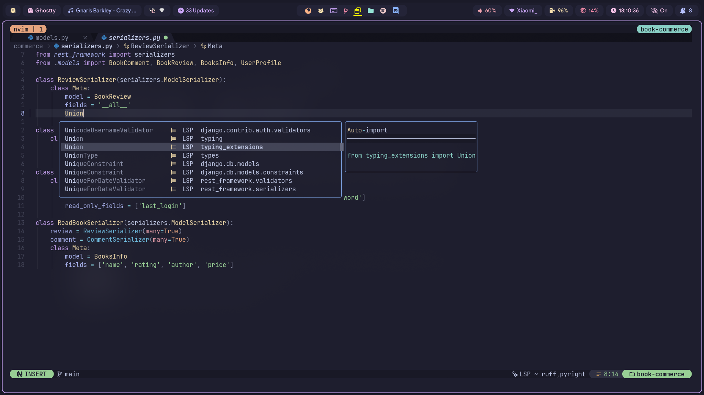
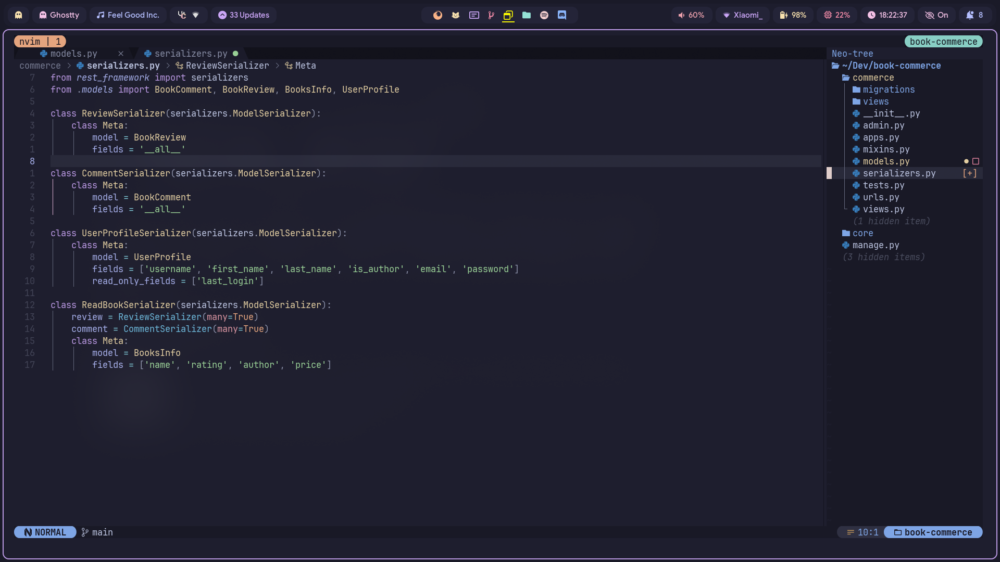

# Neovim config


## Notable Plugins : 

[Barbecue](https://github.com/utilyre/barbecue.nvim) [ VSCode like winbar of neovim ]

[snacks.nvim](https://github.com/folke/snacks.nvim) [ Quality of Life plugins ] 

[Harpoon](https://github.com/Theprimeagen/harpoon) [ To jump between files in open workspaces ] 

[Lualine](https://github.com/nvim-lualine/lualine.nvim) [ For pretty lualine (Depends on [Lualine so Fancy](https://github.com/greeid/lualine-so-fancy)) ] 

[NvTerm](https://github.com/NvChad/nvterm) [ For terminals ]

[Oil](https://github.com/stevearc/oil.nvim) [ To edit file tree like buffer ]

[Bufferline](https://github.com/akinsho/bufferline.nvim) [ To view open buffers ]

## :frame_photo: Screenshots

### Dashboard : 
 

### CMP :


### File Explorer


## All Plugins
```
blink.cmp 
conform.nvim 
fidget.nvim 
friendly-snippets 
gitsigns.nvim 
lazy.nvim 
lualine-so-fancy.nvim 
lualine.nvim 
mason-lspconfig.nvim 
mason-tool-installer.nvim 
mason.nvim 
mini.nvim 
nvim 
nvim-lspconfig 
nvim-material-icon 
nvim-treesitter 
plenary.nvim 
snacks.nvim 
telescope-fzf-native.nvim 
telescope-ui-select.nvim 
telescope.nvim 
todo-comments.nvim 
which-key.nvim 
barbecue 
bufferline.nvim 
harpoon 
indentmini.nvim 
lazydev.nvim 
neo-tree.nvim 
nui.nvim 
nvim-autopairs 
nvim-lint 
nvim-navic 
nvterm 
oil.nvim 
peek.nvim 
presence.nvim 
```
